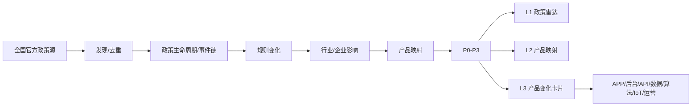

# Policy Mapping｜政策产品雷达

> **把政策变化，变成产品变化。**  
> From Policy Change to Product Change.

**不是告诉你“出了什么政策”，而是告诉你“这项政策会让什么产品发生什么变化”。**

Policy Mapping 将中国政策变化继续向下映射：

**政策 → 规则 → 行业 → 企业 → 产品 → 功能 / 技术 / 运营**

## 与普通政策抓取有什么不同？
普通工具通常停在：`发现 → 抓取 → 摘要 → 分类 → 新闻`

Policy Mapping 继续到：`政策生命周期 → Policy Event Chain → 规则变化 → 行业/企业 → 产品/系统 → 功能/API/算法/IoT/运营 → P0-P3 → 产品变化雷达`

它回答的不只是“最近发生了什么？”，而是：**这项政策会让哪些产品发生什么变化？**

## L1 → L2 → L3



- **L1**：发生了什么政策？
- **L2**：这些政策对产品意味着什么？
- **L3**：重点政策具体改哪里？

## Evidence Boundary
严格区分 **F｜政策事实、I｜企业推导、PS｜产品建议**。AI 产品建议不得冒充政策强制要求。

## ★ 个性化相关度
**★ = Policy × Current User Context**。只有用户明确提供行业、岗位、产品、项目或关注方向时才启用 ★；首次使用或上下文不足时不显示 ★、不猜行业。

## Quick Start
```text
使用 Policy Mapping，扫描最近7天全国政策，
输出 L1→L2→L3 政策产品雷达。
```

## Repository Description
> Map China policy changes to concrete product, system, API, algorithm, IoT and operations changes — with evidence boundaries and L1→L2→L3 drill-down reports.

## Topics
`policy` `product-management` `ai-agent` `skills` `china-policy` `regtech` `compliance` `product-strategy` `policy-monitoring` `llm`

完整执行规则见 `SKILL.md`。

## License
MIT
